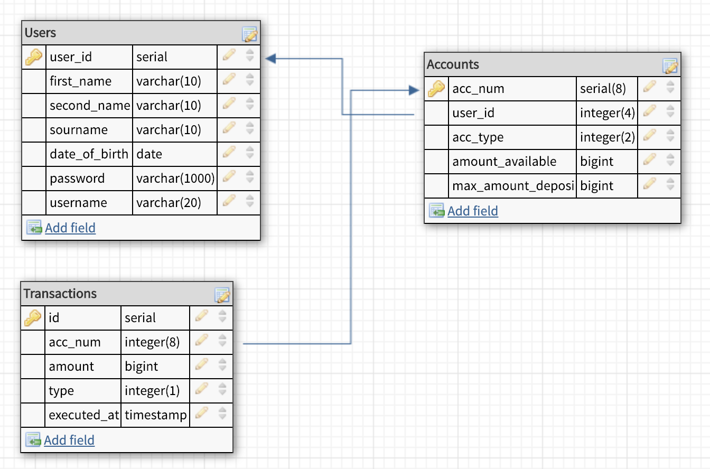
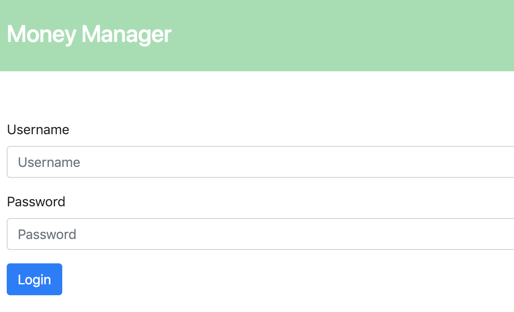

# Money Manager
>This was created during my time as a student at Code Chrysalis

Money Manager is a simple API that helps you keep track of your expenses.

Money Manager is powered by Graphql<br> 


Node<br>


and PostrgeSQL<br>


<br>

## Setup

Install [PostgreSQL](https://postgresapp.com/) (on Mac)

Clone this repository

```bash
git clone https://github.com/zero4994/money-manager.git
```

Install dependencies

```bash
yarn
```

Create database

```bash
CREATE DATABASE m_manager;
```

Run migrations files

```bash
yarn migrate
```

The created database will have this schema<br>


>**Users**: This is the table that will hold all users


>**Accounts**: In this table the accounts will be stored. There should be only one account per user.


>**Transactions**: In this table all the transactions made by all users will be stored.

<br>

Run seed file

```bash
yarn seed
```

>The seed files contains two users<br><br>
>**username**: bob.k<br>
>**password**: userpass<br><br>
>**username**: harvey.ibarra<br>
>**password**: userpass<br>

<br>

Start the server

```bash
yarn dev
```
<br>

## Endpoints

There are two ways to test the endpoints, using graphiql interface and with the embedded html client

<br>

### Graphiql
To use graphiql start the server and go to 

```bash
http://localhost:3000/graphql
```

on your browser. Here are some queries you can test:
<br>
```bash
{
LoginUser(username: "bob.k", password: "userpass") { 
  	user_id
    first_name
    second_name
    sourname
    date_of_birth
    password
  }
}
```

>Logs in the user<br>

```bash
{
  AccountInfo(userId: 1) { 
    acc_num
    user_id
    acc_type
    amount_available
    max_amount_deposit
  }
}
```
>Queries account information from specific user<br>

```bash
{
  TransactionsByUser(userId: 1) { 
    id
    acc_num
    amount
    type
    executed_at
  }
}
```
>Queries all transactions for specific user<br>

The full list of resolvers is available at **server/schema.js**

<br>

### HTML Client

Money manager comes with and embedded simple html client to use it go to

```bash
http://localhost:3000
```

on your browser. You will be prompted with to login.



You can use any of the users stored in the **Users** table.

The defaults are: 

>**username**: bob.k<br>
>**password**: userpass<br><br>
>**username**: harvey.ibarra<br>
>**password**: userpass<br>